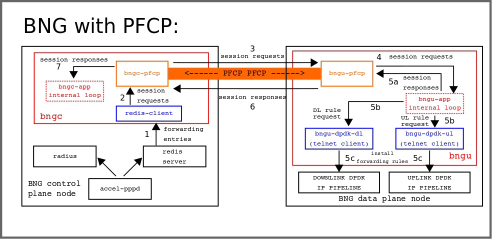

# Instructions for running PFCP-based BNG

The following instructions were tested on Ubuntu 18.04. Internally, the BNG control and user plane application components are represented as in the following figure:



## Install dependencies

### Clone this git repository

```
git clone https://github.com/dpdk-vbng-cp/pfcp-bng.git
cd pfcp-bng
```

### Install bngu/bngc dependencies (mandatory)

```
cd build/scripts
./install_bng_deps
```

### Install redis server (optional for testing PFCP applications locally)

To locally test the application we need a redis server running in the host machine. The following instructions install the redis server from [redis.io](https://redis.io/):

```
cd
wget http://download.redis.io/redis-stable.tar.gz
tar -xzvf redis-stable.tar.gz
cd redis-stable
make
```

### Install redis client (optional for testing PFCP applications locally)

We use a local redis client that simulates messages that would be sent from accel-pppd in a real setup. This can be cloned from the following repository:

```
git clone https://gitlab.bisdn.de/vBNG/pfcp_redis_clients.git
cd pfcp_redis_clients
./compile.sh
```

## Build and compile BNGU/BNGC

### Build and compile both BNGU and BNGC

To execute both BNGU and BNGC applications in the same host, the `bng_builder` script can be used to build and compile both applications. Otherwise, the following subsections provide instructions on how to individually compile the BNGC/BNGU.

A "Debug" argument can be provided to enable runtime debug messages on the applications.

```
cd ~/bng-pfcp/build/scripts
./bng_builder [Debug]
```

### Build and compile BNGC

The `compile_bngc` command is used to build and compile only the BNGC application. Similarly as above, the "Debug" argument can be specified as input.

```
cd ~/bng-pfcp/build/scripts
./compile_bngc [Debug]
```

### Build and compile BNGU

The `compile_bngu` command is used to build and compile only the BNGU application. Similarly as above, the "Debug" argument can be specified as input.

```
cd ~/bng-pfcp/build/scripts
./compile_bngu [Debug]
```

## Set up network namespaces for testing

To test both BNGU and BNGC applications, we need two hosts. This can be locally tested by having the BNGC running in a network namespace connected to the host machine by a veth pair. In addition, we locally use a redis server and a redis client to send messages to the BNGC. In this example, the following topology is considered:

```
+----------------------------------------------------------------------+
|                              +--------------+       +--------------+ |
|                              | redis server |---+---| redis client | |
|                              +--------------+   |   +--------------+ |
| +------------------------+                      |                    |
| | +------+               |                      |      +------+      |
| | |      | 192.168.100.1 |      192.168.100.2   |      |      |      |
| | | BNGC |---------------|----------------------+------| BNGU |      |
| | |      | veth0-0       |            veth0-1          |      |      |
| | +------+               |                             +------+      |
| |            ns0         |                                 |         |
| +------------------------+                        external |         |
|                              (host machine)      interface |         |
+------------------------------------------------------------|---------+
                                                             |
                                                             |
                                                     +--------------+
                                                     | podwhale4.   |
                                                     | lab.bisdn.de |
                                                     +--------------+
```

To configure the ns0 namespace and respective IP addressing, run the following script:

```
./setup_bngc_ns.sh
```

## Configuring and running BNGU and BNGC applications

### Configuration

Both BNGU and BNGC application read a JSON file when starting up. The default file are *bngu.json* and *bngc.json*, respectively. An alternative configuration file can be provided as a CLI argument.

### Running the applications

The BNGU application will send an Association Setup request message to the BNGC when it starts, so we initially need to first start the BNGC.

Yet, since the BNGC will connect to a redis server on startup and in this example, the redis server runs in the same host machine, we first need to instantiate a redis server.

#### Start the redis server (terminal 1)

After starting the redis server, we also need to disable its protected mode option, so it does not only accept connections from localhost.

```
cd ~/redis-stable/src
# Run redis server in background
./redis-server &

# Run redis cli to configure redis server
./redis-cli

# Write the following command in the redis cli
CONFIG SET protected-mode no
```

#### Run BNGC (terminal 2)

To run the BNGC, we will open one bash shell on the respective namespace, so it is easier to run commands directly.

```
# Start bash shell in ns0
sudo ip netns exec ns0 /bin/bash

# Enter bngc build folder
cd ~/bng-pfcp/build/bngc/build

# Run bngc
sudo ./bngc bngc.json
```


#### Run BNGU (terminal 3)

```
# Enter bngu build folder
cd ~/bng-pfcp/build/bngu/build

# Run bngu
sudo ./bngu bngu.json

```

#### Publish messages in the redis bus (terminal 4)

```
cd ~/pfcp_redis_clients
# Publish the contents from the input.json file
./redis_json_publisher 127.0.0.1 6379 input.json
```
