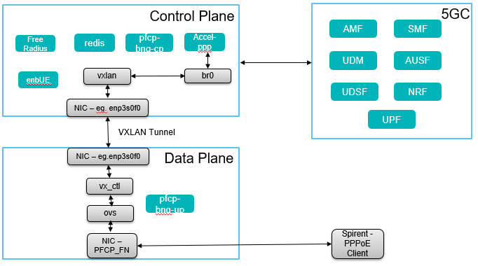

# Instructions for running PFCP-based BNG with 5GC

The following instructions were tested on Ubuntu 18.04. Internally, the BNG control and user plane application components are represented as in the following figure:



## Known limitations

* AtomicHashMaps used to manage timers/message procedures in the PFCP stack implementation can get full and stop the control plane application. We experienced this when having the control application run with 16 PFCP user plane associations for a long period of time.

## Building docker container images

### 1. Base image

Build the base docker image from the top repository directory:

```
docker build -f packaging/pfcp-bng-base/Dockerfile . -t bisdn/pfcp-bng-base
```

### 2. Control and user plane images

#### Control plane image

Enter the control plane packaging directory and build an image:

```
cd packaging/pfcp-bng-cp
docker build . -t bisdn/pfcp-bng-cp

```

#### User plane image

Enter the user plane packaging directory and build an image:

```
cd packaging/pfcp-bng-up
docker build . -t bisdn/pfcp-bng-up

```

## Manually compiling and installing BNG application

### Install dependencies

#### Clone this git repository

```
git clone https://github.com/dpdk-vbng-cp-altran/pfcp-bng.git
git checkout <branch-name>
cd pfcp-bng
```

#### Install bngu/bngc dependencies (mandatory)

```
cd build/scripts
./install_bng_deps
```

#### Install redis server (optional for testing PFCP applications locally)

To locally test the application we need a redis server running in the host machine. The following instructions install the redis server from [redis.io](https://redis.io/):

```
cd
wget http://download.redis.io/redis-stable.tar.gz
tar -xzvf redis-stable.tar.gz
cd redis-stable
make
```

#### Install redis client (optional for testing PFCP applications locally)

We use a local redis client that simulates messages that would be sent from accel-pppd in a real setup. This can be cloned from the following repository:

```
git clone https://gitlab.bisdn.de/vBNG/pfcp_redis_clients.git
cd pfcp_redis_clients
./compile.sh
```

### Build and compile BNGU/BNGC

#### Build and compile both BNGU and BNGC

To execute both BNGU and BNGC applications in the same host, the `bng_builder` script can be used to build and compile both applications. Otherwise, the following subsections provide instructions on how to individually compile the BNGC/BNGU.

A "Debug" argument can be provided to enable runtime debug messages on the applications.

```
cd ~/bng-pfcp/build/scripts
./bng_builder [Debug]
```

#### Build and compile BNGC

The `compile_bngc` command is used to build and compile only the BNGC application. Similarly as above, the "Debug" argument can be specified as input.

```
cd ~/bng-pfcp/build/scripts
./compile_bngc [Debug]
```

#### Build and compile BNGU

The `compile_bngu` command is used to build and compile only the BNGU application. Similarly as above, the "Debug" argument can be specified as input.

```
cd ~/bng-pfcp/build/scripts
./compile_bngu [Debug]
```

#### Build and compile enbUE
enbUE is delivered as a binary hence compilation procedure is not included. In order to run the binary 
goto 5G_enbUE/execute/bin directory.

```
cd ~/bng-pfcp/enbUE/execute/bin
./ranbExe
```

### Set up network namespaces for testing

To test both BNGU and BNGC applications, we need two hosts. This can be locally tested by having the BNGC running in a network namespace connected to the host machine by a veth pair. In addition, we locally use a redis server and a redis client to send messages to the BNGC. In this example, the following topology is considered:

```
+----------------------------------------------------------------------+
|                              +--------------+       +--------------+ |
|                              | redis server |---+---| redis client | |
|                              +--------------+   |   +--------------+ |
| +------------------------+                      |                    |
| | +------+               |                      |      +------+      |
| | |      | 192.168.100.1 |      192.168.100.2   |      |      |      |
| | | BNGU |---------------|----------------------+------| BNGC |      |
| | |      | veth0-0       |            veth0-1          |      |      |
| | +------+               |                             +------+      |
| |            ns0         |                                 |         |
| +------------------------+                        external |         |
|                              (host machine)      interface |         |
+------------------------------------------------------------|---------+
                                                             |
                                                             |
                                                     +--------------+
                                                     | podwhale4.   |
                                                     | lab.bisdn.de |
                                                     +--------------+
```

To configure the ns0 namespace and respective IP addressing, run the following script:

```
./setup_bngc_ns.sh
```

### Configuring and running BNGU and BNGC applications with 5GC

#### Configuration

Both BNGU and BNGC application read a JSON file when starting up. The default file are *bngu.json* and *bngc.json*, *bngc_enbue.json*, respectively. An alternative configuration file can be provided as a CLI argument.

#### Running the applications

The BNGU application will send an Association Setup request message to the BNGC when it starts, so we initially need to first start the BNGC.

Yet, since the BNGC will connect to a redis server on startup and in this example, the redis server runs in the same host machine, we first need to instantiate a redis server.

##### Start the redis server (terminal 1)

After starting the redis server, we also need to disable its protected mode option, so it does not only accept connections from localhost.

```
cd ~/redis-stable/src
# Run redis server in background
./redis-server &

# Run redis cli to configure redis server
./redis-cli

# Write the following command in the redis cli
CONFIG SET protected-mode no
```

##### Run enbUE (terminal 2)

To run the enbUE, execute ./ranbExe executable with appropriate modifications in below config files.
```
In config.cfg, update
    - VINGC_IP field to 5GC IP Address.
    - IP_ADDRESS, DP_IP_ADDRESS fields to bngc pc IP Address

In default_config file, update
    - gtpipaddress, dpteipaddress, sctpipaddress - to bngc IP address
    - dstipaddress - to any IP in the same network
    - amfsctpipaddress - to 5GC IP Address.
    - phy_inface - to the interface in bngc PC connecting 5GC PC.

# Run enbUE
cd ~/bng-pfcp/5G_enbUE/execute/bin/
sudo ./ranbExe
```

##### Run BNGC (terminal 3)

To run the BNGC, we will open one bash shell on the respective namespace, so it is easier to run commands directly.
enbUE should be started before starting bngc.

```
# Start bash shell in ns0
sudo ip netns exec ns0 /bin/bash

# Enter bngc build folder
cd ~/bng-pfcp/build/bngc/build

#Update bngc_enbue.json
 - "enb_ipaddr" to bngc ip address.
 - "amfSctpAddr" to 5GC System IP Address.
 - "ipaddr" to bngc ip address.

# Run bngc
sudo ./bngc bngc.json bngc_enbue.json
```


##### Run BNGU (terminal 4)

```
# Enter bngu build folder
cd ~/bng-pfcp/build/bngu/build

# Run bngu
sudo ./bngu bngu.json
```

##### Start accel-ppp for processing PPPoE/DHCP (terminal 5)

For running accel-ppp, install libevent-dev in addition to existing software requirements.
Few new flags introduced in accel-ppp.conf file for 5G. 

5g-registration-wanted = 1 -> Indicates whether the IP Address should be allocated from 5GC.
ev_5g_registration = yes -> Indicates if redis message for 5G registration should be published.

```
# Start accel-ppp reading default configuration from accel-ppp.conf file.
./accel-pppd -c accel-ppp.conf
```

##### Run 5GC docker containers (diferent pc)

```
5GC should be started in a different system and should have connectivity with bng system.
```

##### Initiate PPPoE client session

```
Initiate PPPoE Client session with remote tags/cirucuit tags from Spirent/Testcenter. 
IP Address and Tunnel ID should be generated and provided by 5GC after the completion 
of 5G registration and PDU establishment procedure.

PPPoE client shall be assigned with 5GC IP address.
```
